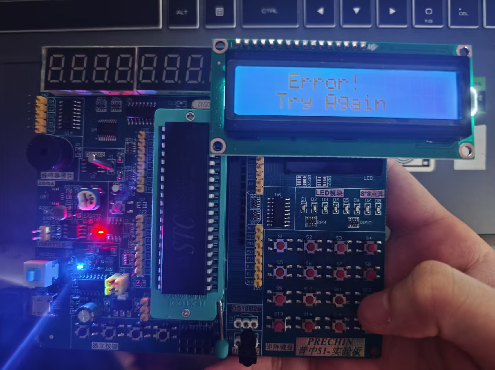
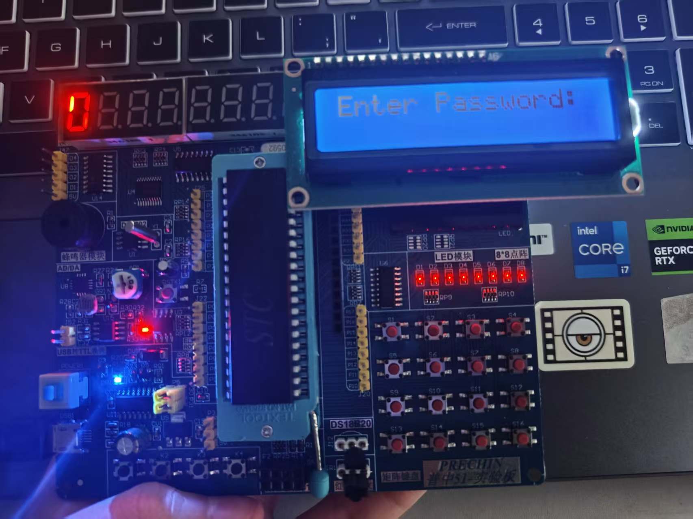
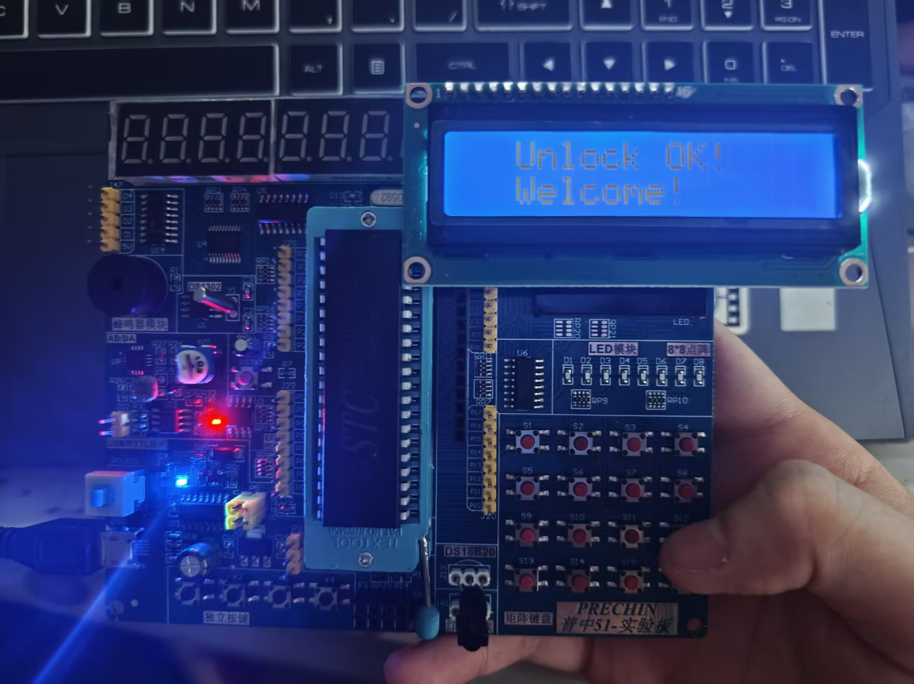
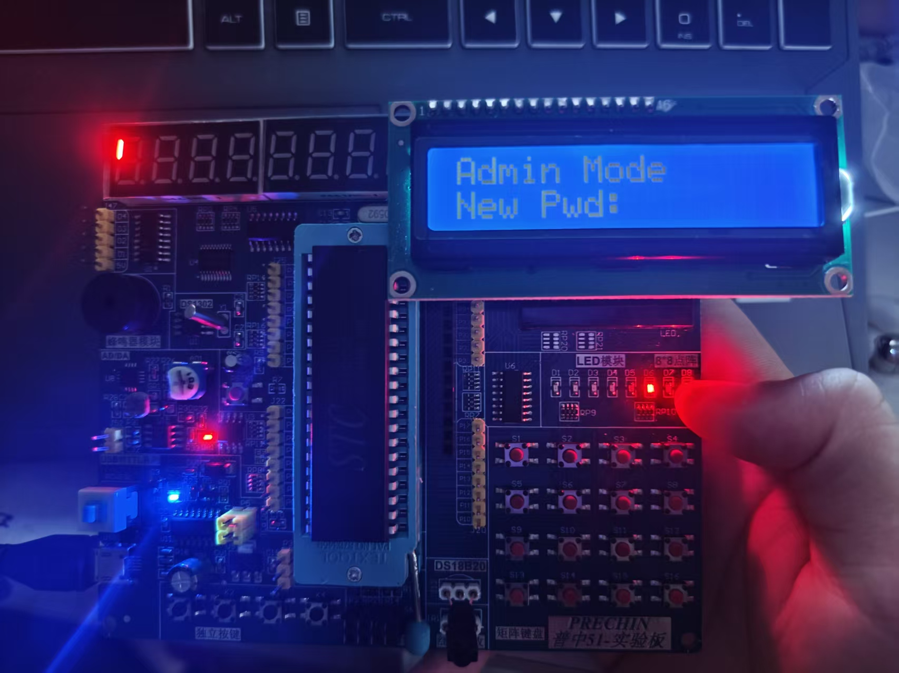

# 🔐 Smart-Password-Lock

基于 STC89C52RC 单片机的智能电子密码锁系统

---

## 📖 项目简介

本项目基于 STC89C52RC 单片机，设计并实现了一款具备多重安全机制的电子密码锁系统。系统采用 LCD1602 作为主显示界面，8位动态数码管辅助显示状态信息，8×8 LED点阵提供解锁成功的图形化反馈。

核心功能包括：6位密码输入与验证、连续错误3次自动锁定30秒、管理员模式支持动态修改密码、EEPROM掉电存储确保密码断电不丢失。

---

## 🎮 按键功能说明

| 物理按键 | 功能 |
|:-------:|:----:|
| `0-9` | 输入密码数字 |
| `E` | 确认密码 |
| `B` | 退格删除 |
| `M` | 进入管理员模式 |

---

## 📸 效果展示

| 密码输入 | 输入错误 | 解锁成功 | 管理员模式 |
|---------|---------|---------|-----------|
|  |  |  |  |

---

## 🚀 功能特性

- ✅ 6位密码输入，LCD显示 `*` 保护隐私
- ✅ 密码验证，正确解锁 / 错误提示
- ✅ 连续错误 **3次** 自动锁定 **30秒**，数码管倒计时
- ✅ 管理员模式（按 `M` 键），支持动态修改密码
- ✅ EEPROM 掉电存储，密码断电不丢失
- ✅ 解锁成功 LED点阵显示 😊 笑脸
- ✅ 蜂鸣器提供按键反馈与报警提示

---

## 🔌 硬件资源

| 模块 | 型号 | 用途 |
|------|------|------|
| 主控芯片 | STC89C52RC | 核心处理器 |
| 显示模块 | LCD1602 | 主交互界面 |
| 状态显示 | 8位动态数码管 | 倒计时/状态显示 |
| 图形反馈 | 8×8 LED点阵 | 解锁成功笑脸反馈 |
| 音频反馈 | 无源蜂鸣器 | 按键音/报警 |
| 输入模块 | 4×4矩阵键盘 | 密码输入 |
| 存储模块 | 内部EEPROM | 密码非易失保存 |

---

## 🔌 硬件接线

| 外设 | 引脚 |
|------|------|
| LCD1602 | RS-P2.6, RW-P2.5, EN-P2.7, D0-D7-P0 |
| 矩阵键盘 | P1.0-P1.7 |
| 蜂鸣器 | P1.5 |
| 数码管位选 | P2.0-P2.7 |
| 数码管段选 | P0.0-P0.7 |
| LED点阵 | P0口(列), P1口(行) |

## 🛠️ 开发环境

| 工具 | 版本 |
|------|------|
| 编译器 | Keil C51 |
| 烧录工具 | STC-ISP V6.92 |
| 芯片型号 | STC89C52RC |
| 晶振频率 | 11.0592MHz |

---

## 📥 烧录步骤

1. 使用 Keil 编译代码，生成 `.hex` 文件
2. 打开 STC-ISP，选择芯片型号 `STC89C52RC`
3. 加载 `.hex` 文件
4. 点击 **下载/编程**，然后给开发板断电重启

---

## 📊 运行效果

| 状态 | LCD显示 | 其他反馈 |
|------|---------|---------|
| 待机 | `Enter Password:` | 数码管显示当前输入位数 |
| 输入密码 | `******` | 蜂鸣器按键反馈 |
| 解锁成功 | `Unlock OK!` | 点阵显示笑脸，蜂鸣器响两声 |
| 密码错误 | `Error!` | 蜂鸣器长鸣一声 |
| 锁定状态 | `Locked! 30s` | 数码管倒计时 |

---

## 📄 开源协议

MIT License

---

## 👤 作者

- GitHub: [Zhuuxd](https://github.com/Zhuuxd)
- Email: zhuuxd@163.com
- 项目地址: [https://github.com/Zhuuxd/Smart-Password-Lock](https://github.com/Zhuuxd/Smart-Password-Lock)
